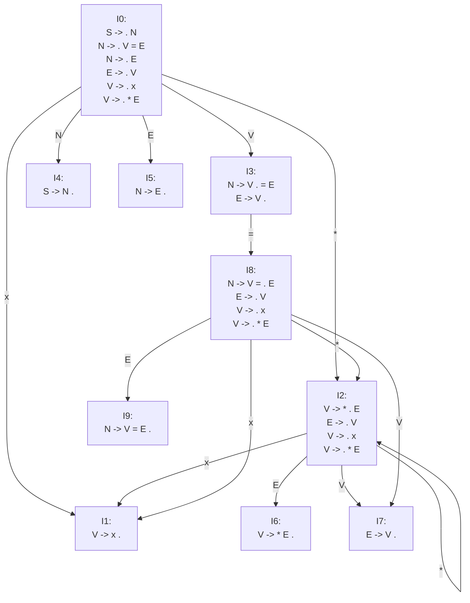

# A Tutorial Explaining LALR(1) Parsing

Based on the original tutorial by Stephen Jackson.
This version fixes a few table/transition inconsistencies.

## Introduction

Many parsing introductions make syntax analysis look harder than it is. In practice, the core building blocks are:

- regular expressions (for tokenization),
- context-free grammars (for syntax rules),
- pushdown automata (for parser behavior).

The tutorial uses small, focused steps.

## Input

A parser starts with lexical analysis. Raw input text is converted into tokens using regular expressions.
For example, `25` matches `[0-9]+` and can be classified as a `num` token.

Then tokens are checked against grammar productions.
Example grammar for simple binary expressions:

```text
binop -> num + num
      | num - num
      | num * num
      | num / num
```

Refactored form:

```text
binop     -> num operation num
operation -> + | - | * | /
```

Recursive version:

```text
binop     -> recbin operation num
recbin    -> recbin operation num
         | num
operation -> + | - | * | /
```

This can derive expressions like `4 / 2 - 1 * 3 + 5`.

### Side note: problematic grammars

1. Useless recursion:

```text
recdemo -> num
recdemo -> recdemo
```

The second production can recurse forever and prevents useful progress.

2. Ambiguity (dangling else):

```text
code    -> if boolean code
        | if boolean code else code
        | arbitrarycode
boolean -> true | false
```

For `if true if false arbitrarycode else arbitrarycode`, the parser cannot decide which `if` owns `else` unless the grammar is rewritten or precedence rules are added.

### Start rules and empty productions

A grammar needs an explicit start non-terminal.
In parser generators, this is usually augmented as `S' -> S`.

Example:

```text
start     -> binop
binop     -> recbin operation num
recbin    -> recbin operation num | num
operation -> + | - | * | /
```

Empty productions are allowed:

```text
binop -> recbin operation num | epsilon
```

or as separate lines:

```text
binop -> recbin operation num
binop -> epsilon
```

### Terminology

- Production: grammar rule.
- Non-terminal: production name (`start`, `binop`, ...).
- Terminal: token (`+`, `-`, `*`, `/`, `num`, ...).

Grammar tool (archived original):  
<https://web.archive.org/web/20150811005320/http://web.cs.dal.ca/~sjackson/lalr1.html>

## Syntax Analysis

Use grammar:

```text
0. S -> N
1. N -> V = E
2. N -> E
3. E -> V
4. V -> x
5. V -> * E
```

### Item sets

An item is a production with a dot:

- `S -> . N` (nothing recognized yet),
- `S -> N .` (fully recognized).

Initial closure:

```text
I0:
S -> . N
N -> . V = E
N -> . E
E -> . V
V -> . x
V -> . * E
```

Continuing closure/goto gives `I0..I9`.

### State graph



### Translation (transition) table

| Item Set | x | = | * | N | E | V |
|---------:|---|---|---|---|---|---|
| **0**    | 1 |   | 2 | 4 | 5 | 3 |
| **1**    |   |   |   |   |   |   |
| **2**    | 1 |   | 2 |   | 6 | 7 |
| **3**    |   | 8 |   |   |   |   |
| **4**    |   |   |   |   |   |   |
| **5**    |   |   |   |   |   |   |
| **6**    |   |   |   |   |   |   |
| **7**    |   |   |   |   |   |   |
| **8**    | 1 |   | 2 |   | 9 | 7 |
| **9**    |   |   |   |   |   |   |

### Extended grammar

Shorthand `0*2` means: from state `0`, on terminal `*`, go to state `2`.

```text
0.  0_S_$ -> 0_N_4
1.  0_N_4 -> 0_V_3 3_=_8 8_E_9
2.  0_N_4 -> 0_E_5
3.  0_V_3 -> 0_x_1
4.  0_V_3 -> 0_*_2 2_E_6
5.  0_E_5 -> 0_V_3
6.  2_E_6 -> 2_V_7
7.  2_V_7 -> 2_x_1
8.  2_V_7 -> 2_*_2 2_E_6
9.  8_E_9 -> 8_V_7
10. 8_V_7 -> 8_x_1
11. 8_V_7 -> 8_*_2 2_E_6
```

### FIRST sets

For this grammar:

- FIRST(V) = { x, * }
- FIRST(E) = { x, * }
- FIRST(N) = { x, * }
- FIRST(S) = { x, * }

### FOLLOW sets

For this grammar:

```text
Follow(S) = { $ }
Follow(N) = { $ }
Follow(E) = { $, = }
Follow(V) = { $, = }
```

### Action and goto table

| State | Action($) | Action(x) | Action(=) | Action(*) | Goto(N) | Goto(E) | Goto(V) |
|------:|-----------|-----------|-----------|-----------|---------|---------|---------|
| **0** |           | s1        |           | s2        | 4       | 5       | 3       |
| **1** | r4        |           | r4        |           |         |         |         |
| **2** |           | s1        |           | s2        |         | 6       | 7       |
| **3** | r3        |           | s8        |           |         |         |         |
| **4** | accept    |           |           |           |         |         |         |
| **5** | r2        |           |           |           |         |         |         |
| **6** | r5        |           | r5        |           |         |         |         |
| **7** | r3        |           | r3        |           |         |         |         |
| **8** |           | s1        |           | s2        |         | 9       | 7       |
| **9** | r1        |           |           |           |         |         |         |

`s#` means shift to state `#`.  
`r#` means reduce by grammar rule `#`.

## Syntax parsing example

Parse input: `x = * x`

Initial stack: `0`  
Input with end marker: `x = * x $`

| Input      | Output        | Stack         | Next Action |
|------------|---------------|---------------|-------------|
| `x = * x$` |               | `0`           | Shift 1     |
| `= * x$`   |               | `0,1`         | Reduce 4    |
| `= * x$`   | `4`           | `0,3`         | Shift 8     |
| `* x$`     | `4`           | `0,3,8`       | Shift 2     |
| `x$`       | `4`           | `0,3,8,2`     | Shift 1     |
| `$`        | `4`           | `0,3,8,2,1`   | Reduce 4    |
| `$`        | `4,4`         | `0,3,8,2,7`   | Reduce 3    |
| `$`        | `4,4,3`       | `0,3,8,2,6`   | Reduce 5    |
| `$`        | `4,4,3,5`     | `0,3,8,7`     | Reduce 3    |
| `$`        | `4,4,3,5,3`   | `0,3,8,9`     | Reduce 1    |
| `$`        | `4,4,3,5,3,1` | `0,4`         | Accept      |

Reduction output sequence: `4 4 3 5 3 1`.

## Handy reference

Rules:

```text
0. S -> N
1. N -> V = E
2. N -> E
3. E -> V
4. V -> x
5. V -> * E
```

Parse table is the same as in the Action/Goto section above.

## Resources

- Original archived tutorial: <https://web.archive.org/web/20150811005320/http://web.cs.dal.ca/~sjackson/lalr1.html>
- LR parser overview: <https://en.wikipedia.org/wiki/LR_parser>
- LALR parser overview: <https://en.wikipedia.org/wiki/LALR_parser>
- BYACC (Berkeley YACC): <https://invisible-island.net/byacc/byacc.html>
- Parsing Techniques: A Practical Guide (book)
- Modern Compiler Implementation (book)
- Compilers: Principles, Techniques, and Tools ("Dragon Book")

The original tutorial text is attributed to Stephen Jackson.
